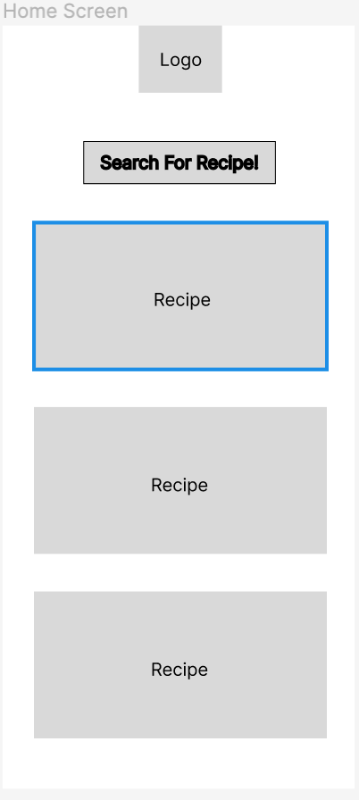
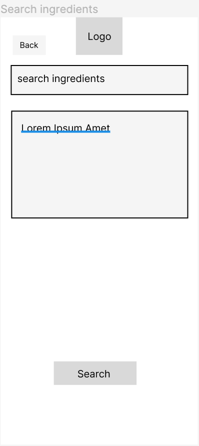
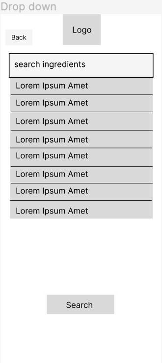
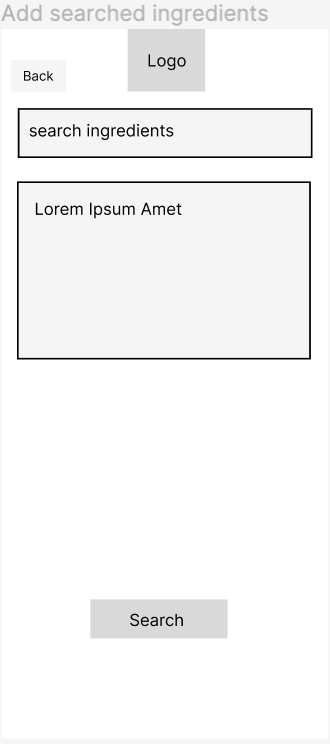
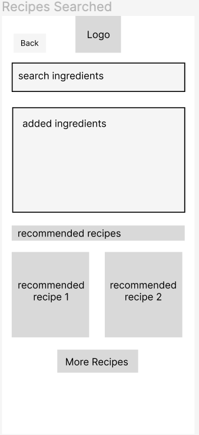
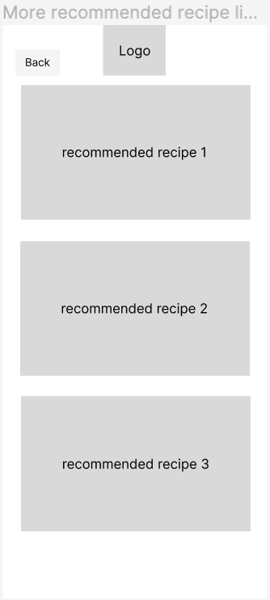
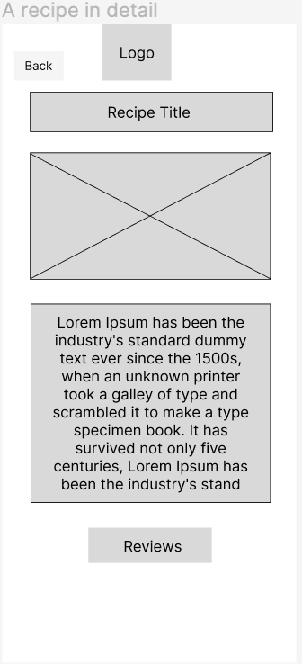
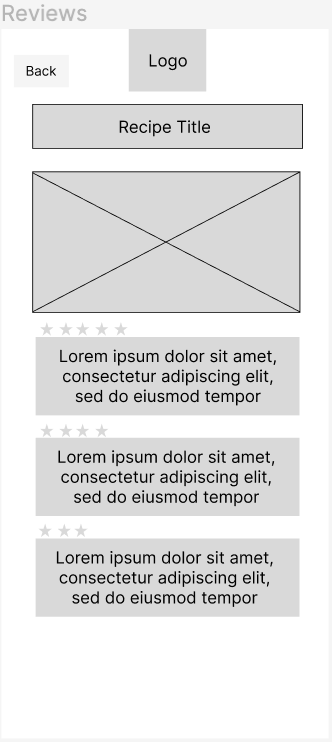

# User Experience Design

## Wireframe

Title: Home Screen  
Description: This is the home screen where user can start searching for recipes, and check out some popular top recipes.

Title: Search ingredients  
Description: This is the screen where user can add ingredients. Users just go to search in the search box.

Title: Drop down  
Description: This is the screen when user press search box and search. There will be drop down indicating relevant search.

Title: Add search ingredients   
Description: This is what will appear when you add an ingredient using search box.

Title: Recipe searched  
Description: This is the screen shown after user click search recupe button.

Title: More recommended recipes  
Description: This is the screen presenting more recommended recipes to explore.

Title: Recipe Detail  
Description: This is the screen showing more details for one specific recipe.

Title: Review  
Description: This is the screen presenting the reviews for one recipe.

## App Map

<a href="https://www.figma.com/file/1vdUMV2cn0o1P7lHbhstqE/Recipe-Grandma?node-id=0%3A1" target="_blank">Link to Figma</a>

The app map shows the parent/child relationship of all the screens on our app. There are 5 different screens we will be creating: 
1. Home
2. Add ingredients
3. Recipe list
4. Individual recipe 
5. Reviews

From the **Home** screen, users will be able to navigate to **Add ingredients** screen, as well as to **Individual recipe** pages. **Individual recipe** will have a link to the **Reviews** page where users can check out reviews of the recipe. **Add ingredients** screen will have links to a few **Individual recipe** pages to give a sneak peek of the  recipes possible with the given ingredients, as well as a link to the **Recipe list** page where there will be the full collection of **Individual recipe** pages based on the ingredients added. 

