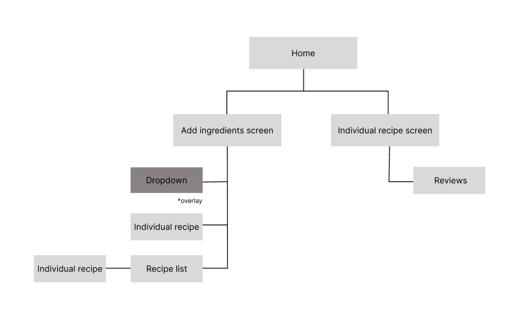

# User Experience Design

## Wireframe

## App Map

The app map shows the parent/child relationship of all the screens on our app. There are 5 different screens we will be creating: 
1. Home
2. Add ingredients
3. Recipe list
4. Individual recipe 
5. Reviews

From the **Home** screen, users will be able to navigate to **Add ingredients** screen, as well as to **Individual recipe** pages. **Individual recipe** will have a link to the **Reviews** page where users can check out reviews of the recipe. **Add ingredients** screen will have links to a few **Individual recipe** pages to give a sneak peek of the  recipes possible with the given ingredients, as well as a link to the **Recipe list** page where there will be the full collection of **Individual recipe** pages based on the ingredients added. 

